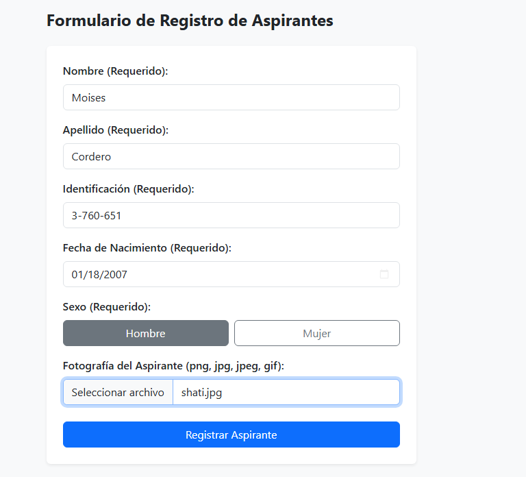
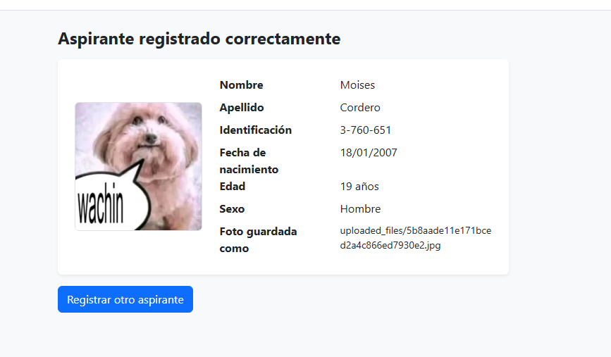
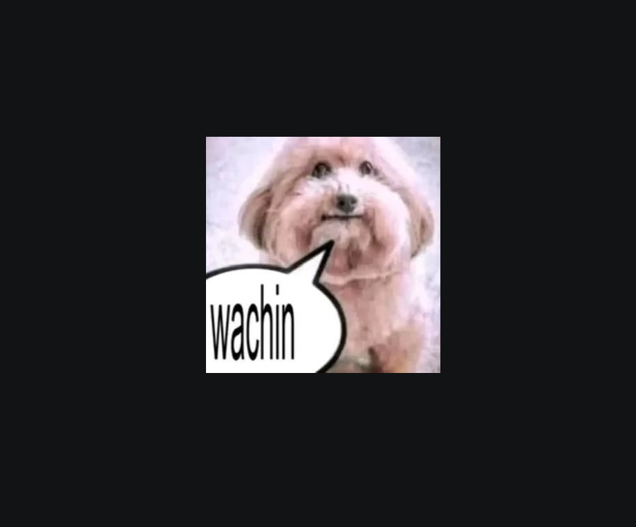

# Taller-Aspirantes

## Objetivo

Desarrollar un sistema web de **Registro de Aspirantes** con HTML5, Bootstrap 5.3.8 y PHP, que reciba los datos de un formulario, los valide y estandarice del lado del servidor, y guarde la fotografía del aspirante en una carpeta protegida del proyecto, **sin usar base de datos**.

---

## Detalles del Laboratorio

| Campo | Detalle |
| --- | --- |
| **Universidad** | Universidad Tecnológica de Panamá — Facultad de Ingeniería de Sistemas Computacionales |
| **Curso** | Desarrollo Web |
| **Laboratorio** | #3 — Subir Archivos |
| **Instructor** | Ing. Irina Fong |
| **Asignación / Entrega** | 18 de septiembre de 2026 / 02 de octubre de 2026 |

**Requerimientos técnicos cumplidos:**

- Maquetación con Bootstrap y etiquetas semánticas `<header>`, `<main>`, `<section>` y `<footer>`.
- El formulario se encuentra dentro de `<main><section>`.
- Menú de navegación y migas de pan modularizados con `include` (`header.php`), junto con el footer y el formulario.
- Validación en el backend: campos no vacíos y edad entre **18 y 70 años**.
- Estandarización de nombre y apellido a formato tipo título (ej. `sofia` → `Sofia`).
- Foto guardada de forma segura en `uploaded_files/`, sin base de datos, y con la carpeta bloqueada al acceso desde el navegador.

---

## Tecnologías y Versiones

| Tecnología | Versión |
| --- | --- |
| PHP | 8.0 o superior (extensiones `mbstring` y `fileinfo` activas) |
| HTML5 | — |
| Bootstrap | 5.3.8 (CDN) |
| Bootstrap Icons | 1.11.3 (CDN) |
| Servidor web | Apache (WampServer 64-bit) |
| Editor | Visual Studio Code |
| Sistema Operativo | Windows |

---

## Estructura de Carpetas

```
Taller-Aspirantes/
├── assets/                 # Capturas de pantalla del README
├── includes/
│   ├── header.php          # Metadatos, <header>, Navbar y Breadcrumb dinámico
│   ├── footer.php          # <footer> con enlaces, redes y año dinámico
│   └── formulario.php      # Formulario de registro
├── uploaded_files/
│   ├── .gitkeep            # Mantiene la carpeta en Git
│   └── .htaccess           # Bloquea el acceso desde el navegador
├── index.php               # Página principal con el formulario
├── procesar.php            # Backend: valida, formatea, guarda y muestra el resultado
├── .gitignore
└── README.md
```

---

## Proceso de Instalación

### 1. Clonar o copiar el proyecto

```
git clone <URL-del-repositorio>
```

O copiar la carpeta `Taller-Aspirantes/` dentro del directorio web de WAMP:

```
C:\wamp64\www\Taller-Aspirantes\
```

### 2. Iniciar los servicios

Abrir **WampServer** y verificar que el ícono esté en verde (Apache activo).

### 3. Verificar los permisos de la carpeta de fotos

La carpeta `uploaded_files/` debe tener permisos de escritura para que PHP pueda guardar las imágenes.

### 4. Permitir el uso de `.htaccess`

En la configuración de Apache, la carpeta del proyecto debe tener `AllowOverride All`. Luego, reiniciar Apache.

### 5. Abrir el sistema

```
http://localhost/Taller-Aspirantes/
```

> No requiere `composer`, `npm` ni base de datos. Solo necesita conexión a internet para cargar Bootstrap desde el CDN.

---

## Controles Utilizados

### Controles del formulario (`index.php` / `formulario.php`)

| Control | Atributos | Uso |
| --- | --- | --- |
| `<input type="text">` | `required`, `placeholder`, `maxlength` | Nombre, Apellido e Identificación |
| `<input type="date">` | `required`, `max` | Fecha de nacimiento |
| `<input type="radio">` + `.btn-check` | `required` | Sexo (Hombre / Mujer) con botones de Bootstrap |
| `<input type="file">` | `accept`, `required` | Fotografía del aspirante |
| `<input type="hidden">` | `csrf_token` | Token de seguridad anti-CSRF |
| `<button type="submit">` | `.btn .btn-primary` | Registrar Aspirante |
| `<form>` | `method="POST"`, `enctype="multipart/form-data"` | Necesario para enviar el archivo de imagen |

### Componentes de Bootstrap

`navbar`, `breadcrumb`, `card`, `form-control`, `btn`, `alert`, `container`, `row` / `col` (diseño responsivo) y Bootstrap Icons en el footer.

### Funciones de PHP

| Función | Propósito |
| --- | --- |
| `include` | Modulariza el header, el footer y el formulario |
| `basename($_SERVER['PHP_SELF'])` | Detecta la página actual para las migas de pan dinámicas |
| `trim()` | Elimina espacios al inicio y al final |
| `strip_tags()` | Elimina etiquetas HTML y PHP de los campos de texto |
| `htmlspecialchars()` | Escapa la salida para prevenir ataques XSS |
| `mb_convert_case()` / `ucwords(strtolower())` | Formato tipo título para nombre y apellido |
| `strtoupper()` | Identificación en mayúsculas |
| `DateTime::diff()` | Calcula la edad a partir de la fecha de nacimiento |
| `finfo` / `getimagesize()` | Verifica que el archivo sea realmente una imagen |
| `random_bytes()` + `bin2hex()` | Genera un nombre aleatorio y seguro para la foto |
| `move_uploaded_file()` | Guarda la foto en `uploaded_files/` |
| `date('Y')` | Año dinámico en el footer |

### Validaciones (`procesar.php`)

| Campo | Regla |
| --- | --- |
| Nombre / Apellido | Requeridos, solo letras; se estandarizan a formato tipo título |
| Identificación | Requerida; letras, números y guiones; se convierte a mayúsculas |
| Fecha de nacimiento | Requerida, válida y no futura; la edad debe estar entre **18 y 70 años** |
| Sexo | Requerido; solo `Hombre` o `Mujer` |
| Fotografía | Requerida; extensiones `jpg`, `jpeg`, `png`, `gif` y `webp`; máximo 2 MB; se valida el tipo MIME real |

### Seguridad de la carpeta de fotos

`uploaded_files/.htaccess` deniega todo acceso desde el navegador (`Require all denied`) y desactiva el listado de directorio. Las fotos se guardan con nombre aleatorio y se muestran en el resultado leídas por PHP desde el servidor (incrustadas en base64).

---

## Insertar Registros

### 1. Formulario de registro

Pantalla principal con el formulario vacío, el menú y las migas de pan.


### 2. Formulario completado

Datos ingresados antes de presionar **Registrar Aspirante**.



### 3. Registro exitoso

Resultado en `procesar.php`: datos estandarizados, edad calculada, foto cargada y nombre con el que se guardó la imagen. Se muestran también las migas de pan dinámicas y el footer.



### 4. Validación de extensión no permitida

Intento de subir un archivo que no es una imagen permitida. El sistema rechaza el registro y muestra el error.


### 5. Foto guardada en el servidor

Carpeta `uploaded_files/` con las fotografías guardadas con nombre aleatorio.



---

## Evidencia de Acciones de Modificar

**No aplica en este laboratorio.** El taller no utiliza base de datos y su alcance es únicamente el registro (inserción) de aspirantes, por lo que no existe una acción de modificar registros.

---

## Evidencia de Acciones de Eliminar

**No aplica en este laboratorio.** Al no existir base de datos, no se implementó una acción de eliminar registros. Las fotos guardadas se pueden borrar manualmente desde la carpeta `uploaded_files/`.

---

## Dificultades y Soluciones

**Problema 1: La carpeta `uploaded_files/` era accesible desde el navegador**
> Al escribir la URL de una foto, la imagen se abría directamente.

**Solución:** Crear `uploaded_files/.htaccess` con `Require all denied` y activar `AllowOverride All` en Apache. Después, reiniciar Apache.

---

**Problema 2: No se podía guardar la foto**
> Aparecía el mensaje "La carpeta de fotografías no tiene permisos de escritura".

**Solución:** Dar permisos de escritura a la carpeta `uploaded_files/` y verificar que exista dentro del proyecto.

---

**Problema 3: Los nombres con tilde se estandarizaban mal**
> `ucwords(strtolower())` no maneja bien las tildes ni la ñ en UTF-8.

**Solución:** Usar `mb_convert_case($texto, MB_CASE_TITLE, 'UTF-8')` y activar la extensión `mbstring` en PHP.

---

**Problema 4: La foto no se veía después de bloquear la carpeta**
> Al bloquear `uploaded_files/`, el navegador ya no podía cargar la imagen con una URL.

**Solución:** Leer la imagen con PHP y mostrarla incrustada en base64 en la página de resultado.

---

## Referencias

- [PHP: Subida de archivos con método POST](https://www.php.net/manual/es/features.file-upload.post-method.php)
- [Bootstrap 5.3: Documentación](https://getbootstrap.com/docs/5.3/getting-started/introduction/)
- [Apache: Archivos .htaccess](https://httpd.apache.org/docs/2.4/howto/htaccess.html)

---

## Fecha de Ejecución

8 de octubre de 2026

---

|                |                                |
| -------------- | ------------------------------ |
| **Nombre**     | Moises Cordero                 |
| **Curso**      | Desarrollo Web                 |
| **Instructor** | Ing. Irina Fong                |